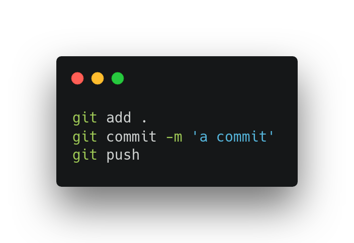
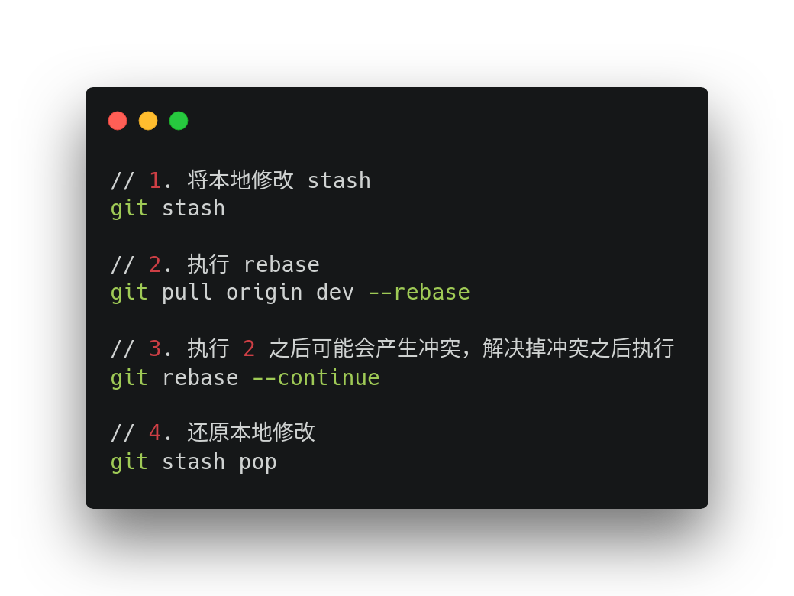

## 常见的 Git 的操作

### 1. 大家都知道的三个基本 Git 命令



### 2. rebase 大法好！

先想想这个问题：合并两个分支要怎么做？

在一开始的时候，我采用的是最基本直接的方式： `git merge branch-name`。这种方式简单、直接、且易于理解，如果两个分支合并是`Fast Forward`形式的话，这种方式是很快捷的。

但是，如果不是`Fast Forward`模式，这次合并操作之后经常会产生一个`Merge`的`commit`记录。

如果你的团队内部有规范`commit`提交记录的格式规则的话，这种`Merge`操作导致的`commit`记录就会与团队内规范的不相符

例如：我们团队中使用的`commit`规范是参照[Angular Commit Message](https://github.com/angular/angular/blob/master/CONTRIBUTING.md#commit)，在你`review`代码的提交记录的时候，突然来一个`Merge someBranch to someBranch`的提交记录，这是很难受的一件事。

在解决上述问题上，我们团队内要求合并分支一律使用`rebase`进行操作。其好处主要是能够保证提交记录的整洁。

同步远端代码的过程大致如下：



## 几个实用的 Git 命令

### 1. 查询自己某天的提交记录

```bash
// 查询自己在当天的提交记录
git log --author=rychouwei --since="0 am"

// 查询自己在某个时间区间的提交记录
git log --author=rychouwei --since="2 hour ago" --until="30 minute ago"
```

### 2. 发现自己少提交了一个文件

这种情况你可能会这样做

```bash
// 先撤销提交记录
git reset --soft HEAD^

// 然后从新将文件提交
```

其实这种情况你只需要这样做就可以了

```bash
git add path-to-forgot-file
git commit --amend

//也可以用新的 commit message覆盖 HEAD记录
git commit --amend -m 'your new commit message'
```

