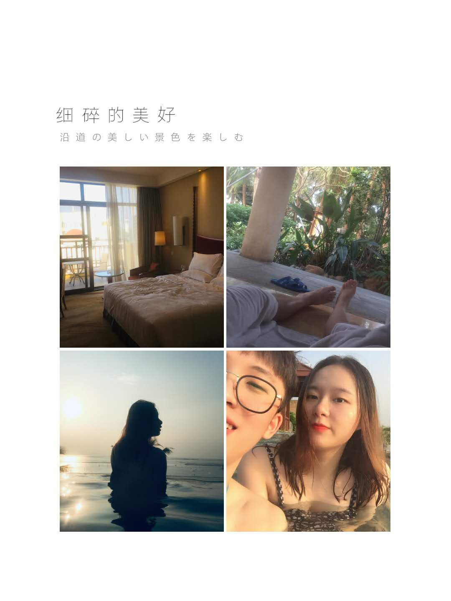

# 一、第一次坐飞机

这是我人生第一次坐飞机呀，内心有很多期待。这次坐飞机发生了一件非常沙雕的事。

机场不是在杭州而是在上海浦东机场，机票是买的金鹏航空早上`6:30`的特价机票，所以需要提前一天晚上出发去上海浦东机场。我是 27 号晚上从杭州去上海，需要在机场过夜。到上海已经 9 点了，去机场的二号线末班是`10:30`的，所以到了人民广场也没时间去吃炸鸡了。直接搭乘地铁去机场了。

关键来了，因为当时没吃晚饭，肚子很饿，穷学生又怕机场的吃的很贵，所以打算在机场前一站下车去找吃的！！！结果一下车发现，这。。。。荒郊野岭哪里有吃的，然后就在地图上找周围的吃的便利店等等，结果在那附近走了近一个小时，放弃了。肚子饿的不行，只能去机场了，又走了一个小时到达机场，腿都要断了。那天我走了 2w 多步。到了机场发现，机场的全家并不贵，哭死了呜呜呜。

然后就是去航站楼了，结果航站楼也走错了，我的是`T2`，我走到`T1`去了。

最后拿了登机牌在地上睡了一会，差点睡过头了（真的是差一点），那天是真是诸事不顺。

不过还好顺利登机啦！

# 二、珠海

> 纵使身心疲惫不堪，只要是要去见你，再累我内心都是很开心的。

从上海到珠海花了 2 个半小时左右，到了珠海已经是早上 10 点了，一宿没睡的我实在是已经困的不行，但是想着要去见自家宝宝，便变得精神起来。二话不说，订了最近一班的到拱北的机场大巴，上车！

这时候的你也准备从学校出发来珠海了，原先订好了从`顺安车站`->`珠海`的车票，在当天早上被告知班车取消了，给我们的珠海之行增添了一个小插曲。不过你也迅速找到了解决办法，那就是搭公车到珠海。也真是很方便只需要换乘一次，就可以搭公车到珠海来了。

## 931 路

> 异地恋最幸福的时刻，莫过于双方见面那一瞬间的对视，之前的分别之苦在这一刻都显地微不足道了。

我在不断驶入驶出公车总站的公车群中寻找着那辆`931路`公车，来了一辆`931路`公车，抬头望去，伸长了脖子(会是你坐的那辆吗？)，目光迅速扫视着车窗内的人群，寻找那个熟悉得不能再熟悉的身影。我没找到，这不是你乘坐的那辆。一辆、两辆、三辆。。。终于在收到你即将进站的消息时，目光锁定了那辆`931路`公车。这时天下起了毛毛雨，在我撑开伞的时候，看到了那个熟悉的身影，在车窗内的你冲我笑了一下。

在接到你后，本想抱你来着，怕尴尬的你冲我耳语着：“快走快走！” 摧毁了我对见面时的想象。这里有点小失落，毕竟对这一刻有着特别的期待。不过也习惯辽，啥时候能治愈你的尴尬癌呢。

## 海泉湾

去海泉湾还是你在双十一之前偶然看到海泉湾的打折票，599 元两个人一天一夜，包括了无限次温泉、游乐场、运动俱乐部等。

到海泉湾度假村已经是下午两点多了，办理了酒店的入住，这里的房间真的很不错。在房间简单休息了一下之后就准备去`泡温泉`了，从酒店到温泉的路程也很近，步行大概十分钟就到了。

### ✔ 第一次一起泡温泉

拿着酒店的房卡，可以无限次去泡温泉，我们当天泡了两次温泉，下午去了一次，晚上在运动俱乐部玩完后还去了一次。温泉真的超舒服哒。👙

晚上去看了海泉湾的梦幻剧场，表演也很棒，还有几个表演的是外国人来的。

### ✔ 第一次一起玩射箭

看完剧场表演之后去了运动俱乐部，玩了射箭和台球。射箭也是第一次玩，你最后一支箭居然射 🎡 中了 10 环，哈哈哈哈哈好厉害！我也表演了一波台球跳球入洞嘻嘻！

### ✔ 第一次一起玩跳楼机

第二天也就是`11月30日`，是我滴生日。今年的生日，你送了我`小米手环3 NFC版`，虽然已经提前送我了，没惊喜，但是也是我很喜欢的礼物，谢谢宝宝啦！

早上一起去吃了酒店的自助早餐，还挺不错哒，吃了很多烤培根肉。吃完就直接去游乐场玩了。

可能由于是淡季，游乐场开放的设施不是很多，玩了镜面迷宫、跳楼机、碰碰车、海盗船。跳楼机真的是好恐怖啊，现在想想都有点手心冒汗，以后都不怎么敢去玩那些项目了。特别是有些游乐场的工作人员还调皮（虽然这里的工作人员不调皮），故意跟你说安全带没系好，然后突然`BOOM`。。。

从海泉湾玩完之后来到了`燊记`,在小红书看到这里的海鲜肠粉很诱人，就想着一起过来吃。但是到的时候肠粉还没开始卖呢，有点小遗憾，不过宝宝超爱吃那里的`湿炒牛河`。

吃完之后就去车站准备坐大巴去广州了，`珠海->广州`

# 三、广州

到了广州当晚，我们也都有点累，就没有出去玩，在酒店待了一晚。

## 第一天

第二天出门去吃了`广九餐室`，忘记菜品名字了，点了鸡腿、猪扒包、巧克力奶茶，两个人吃的挺饱的。吃完之后一起去看了`憨豆特工3`,电影也还挺不错的，票价也很便宜。

晚上呢就去了上下九，人也是真的超级多，没怎么玩，就随便逛了逛，吃了以前一直想吃的陈记鱼皮，口感还不错，￥ 25 的价格偏贵了。还有那边买的`猪脚姜`你说不好吃，味道太重口了。

后来去买了一杯喜茶，不知道叫啥名字，但是口味是葡萄味的，里面的葡萄很好吃，是我喜欢的。之后就准备去吃海底捞了，走了好远，到了之后被告知已经要打烊了，不接客了真是气死，心情瞬间不好了。

## 肠胃炎

> 没事宝宝，有我在呢！

这是这趟旅行唯一唯一不好的点了。在第二天晚上回到酒店已经 11 点多了吧，你因为我在公车的时候去帮你在后面抢座位，没去你身边陪着你，发了小脾气。

在点了外卖（烧烤 🍖）之后不久，你开始肚子不舒服，到厕所里面蹲了半个小时，真把我给担心坏了。当时也不是你的姨妈期，你也没有痛经过，应该是肠胃炎了。跟你说我出门去找找药店有没有药卖，在地图上找了附近所有的药房，跑了一家又一家，没有一家还在营业的药店。当时已经快 1 点了，附近的药房都已经关门了。微信这一头，你跟我说肚子还是痛，担心的不行，跑回酒店，给你烧了热水喝了也不见好转。

这时烧烤外卖也到了，但是根本就没心情吃，带你起身去医院。

出门叫了辆的士，叫司机去离这最近的医院，去了最近的一家中医院。医院这时候只有急诊还开着，在挂号的地方，没有足够的现金，但工作人员还是好心的让我给她一块钱挂了急诊。

医生的初步诊断为`急性肠胃炎`，让宝宝打了一针屁股针和挂吊瓶，大概有 5 袋吊瓶吧。喝了几杯温水之后，你感觉似乎好点了。终于也在这时候，我的心终于踏实了一点了。

在挂吊瓶到一半的时候，救护车送来了一位急诊患者，应该是心梗吧，家属在急诊室外很丧很丧的哭。希望人没事吧！🙏🙏🙏

护士们都去帮忙抢救了，最后一瓶吊瓶还是我自己换的，挂完吊瓶之后跟门诊的人打了声招呼就回去了。

回来已经凌晨三点多了，烧烤也已经冷了。在你睡着之后，我吃了几口已经冷了的烧烤，回想了当天发生的所有，要是你的身体出了什么事情，我真的是担心的不得了。那时的感觉就像我高中有一次带我妹妹去逛超市，在付钱的时候一转眼，妹妹不见了，那感觉就是整个人都懵了，心里慌慌的、空空的。那时候我紧张的不得了，到处叫妹妹的名字，想办法找到妹妹。结果最后发现，她居然在旁边看别人玩游戏机。就是有一种`失而复得`的感觉吧！

## LAST DAY

> 做大做强！

最后一天，也就是你生病的第二天，起来的时候你已经好很多了，我也放心多了。下午去吃了沙县和东北饺子，还一起在酒店附近的一家电影院看了`无名之辈`。

晚上送你坐车回中山之后，我也赶着去火车站坐车了。

到这里，我们的`珠海&广州行`也就结束了，记录的文笔很糟糕，但这也是我最真实的记忆。旅行过程中有开心的时候，也有担心的时候，从中也收获到很多，以后出行的时候得带你吃清淡一点的了，养生旅行 ✔

# 四、美食

<del>emmmm....由于宝宝没上传美食的照片，这里就不贴照片了</del>

打脸了打脸了，在宝宝的朋友圈翻到了美食照片嘻嘻。

这两天吃了很多好吃的

