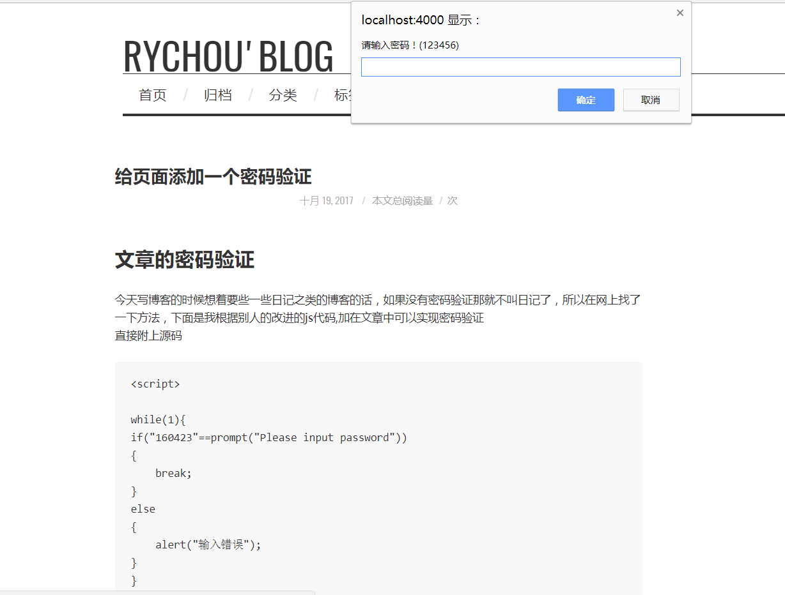

# 文章的密码验证 #
今天写博客的时候想着要些一些日记之类的博客的话，如果没有密码验证那就不叫日记了，所以在网上找了一下方法，下面是我根据别人的改进的js代码,加在文章中可以实现密码验证
<!-- more -->
直接附上源码

    

**注意事项：** 使用时将该段代码放到文章开头，否则就会不起效果。什么意思呢？看下面图片就知道了。

看到了吧，如果放在文章末尾的话，就会先加载js代码前面的部分，也就是文章内容，所以说，为了防止这种情况发生，**得把js代码放在文章开头**

不过这个代码还是不完善的，比如说如果你的主题主页不是单纯的列表页的话，那么你在主页就会出现这个密码验证。所以说不完善，博主还在想办法完善中。
不过我朋友找到一个插件可以设置密码，下面是我朋友的博客文章
[https://bababadboy.github.io/2017/10/18/AES%E5%8A%A0%E5%AF%86hexo%E6%96%87%E7%AB%A0/](https://bababadboy.github.io/2017/10/18/AES%E5%8A%A0%E5%AF%86hexo%E6%96%87%E7%AB%A0/ "文章密码验证插件")
